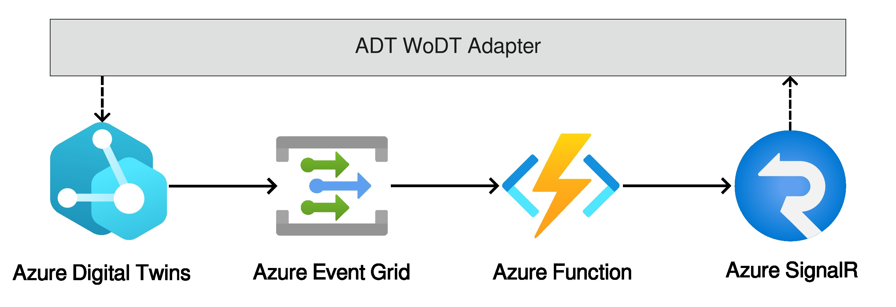

# Azure Digital Twins Web of Digital Twins adapter


[](https://opensource.org/licenses/MIT)


The **[Azure Digital Twins](https://learn.microsoft.com/en-us/azure/digital-twins/overview) (ADT) WoDT Adapter** is a middleware that is able to make ADT DTs compliant with HWoDT ecosystems. 

It is possible to select the DTs to adapt and expose, up to potentially exposing the complete ADT graph as a HWoDT-compliant DT ecosystem. Furthermore, we add the ability to reify relationships between ADT DTs and external DTs within the ADT instance, other than mirroring the internal  relationships in the DT ecosystem KG.

## Architecture
The minimal pipeline to make it works is composed by four services:
1. [**Azure Digital Twins**](https://learn.microsoft.com/en-us/azure/digital-twins/): it manages the Digital Twins to adapt.
2. [**Azure Event Grid**](https://learn.microsoft.com/en-us/azure/event-grid/): it routes events from Azure Digital Twins along the pipeline.
3. [**Azure Function**](https://learn.microsoft.com/en-us/azure/azure-functions/): it has the responsibility of creating a snapshot of the DT, starting from the event. The snapshot is then sent to the azure-wodt-adapter via the *Azure SignalR* service. The code to deploy in the Azure Function is available in [`azuredt-wodt-adapter-azurefunction`](https://github.com/Web-of-Digital-Twins/azuredt-wodt-adapter-azurefunction) repository.
4. [**Azure SignalR**](https://learn.microsoft.com/en-us/azure/azure-signalr/): it is used to make data observable.

In the following, an image depicting this architecture:



## Usage
First of all a Microsoft Entra ID app registration with the Azure Digital Twins Data Owner role is needed to be able to access Azure Digital Twins data -- [Tutorial by Microsoft](https://learn.microsoft.com/en-us/azure/digital-twins/how-to-create-app-registration?tabs=portal).

### Digital Twins Configuration
The ADT Digital Twins to expose are configured with a [Kotlin DSL](https://github.com/Web-of-Digital-Twins/azuredt-wodt-adapter/blob/main/src/main/kotlin/configuration/dsl/AdapterDTsConfigurationDsl.kt). An example of it can be found [here](https://github.com/Web-of-Digital-Twins/azuredt-wodt-adapter/blob/main/src/test/resources/simpleConfiguration.kts). The RDF entities to model the semantics can be understood from the previous example, and found [here](https://github.com/Web-of-Digital-Twins/azuredt-wodt-adapter/blob/main/src/main/kotlin/model/semantics/rdf/RdfEntities.kt).

### Adapter Configuration
To configure the Adapter, you need to specify the following environemnt variables:
- `AZURE_CLIENT_ID`: id of the Microsoft Entra ID app registration.
- `AZURE_CLIENT_SECRET`: secret of the Microsoft Entra ID app registration.
- `AZURE_DT_ENDPOINT`: the Azure Digital Twins instance endpoint.
- `AZURE_TENANT_ID`: the id of the Microsoft Entra ID app registration tenant.
- `DIGITAL_TWINS_CONFIGURATION_PATH`: the path of the [Digital Twins Configuration](#digital-twins-configuration).
- `EXPOSED_PORT`: the port where the ADT WoDT Adapter should expose its uniform interface.
- `EXPOSED_URL`: the url where the ADT WoDT Adapter will be publicy available (including the port if different from the default one).
- `SIGNALR_NEGOTIATION_URL`: the url of the Azure SignalR negotiation service.
- `SIGNALR_TOPIC_NAME`: the topic name used to publish events on Azure SignalR.

### Docker instructions
If you want to run it via docker:
1. Provide an `.env` file with all the environment variable described [above](#adapter-configuration)
2. Run the container with the command:
    ``` bash
    docker run ghcr.io/web-of-digital-twins/azuredt-wodt-adapter:<version>
    ```
    Specifying:
    - A port mapping to the exposed port or a network mode;
    - A volume to pass the Digital Twins Configuration file;
    - The environment variable file.

## Documentation
- Check out the website [here](https://web-of-digital-twins.github.io/azuredt-wodt-adapter/)
- Direct link to the *Code* documentation [here](https://web-of-digital-twins.github.io/azuredt-wodt-adapter/documentation/code-doc/)
- Direct link to the *REST-API* documentation [here](https://web-of-digital-twins.github.io/azuredt-wodt-adapter/documentation/openapi-doc/)

## Useful resources
- [`./dtdl/ExternalDT.json`](https://github.com/Web-of-Digital-Twins/azuredt-wodt-adapter/blob/main/dtdl/ExternalDT.json): to be able to create relationships with Digital Twins external to the ADT instance, we decided to have a very simple representation of the External DT directly within the ADT instance, so that ADT DTs can create relationships with it. Then, the provided Azure Function and this adapter are able to deal with them and include them in the DTD and DTKG.
- [`azuredt-wodt-adapter-azurefunction`](https://github.com/Web-of-Digital-Twins/azuredt-wodt-adapter-azurefunction): the Azure Function to deploy in the Azure pipeline to work with this adapter.
